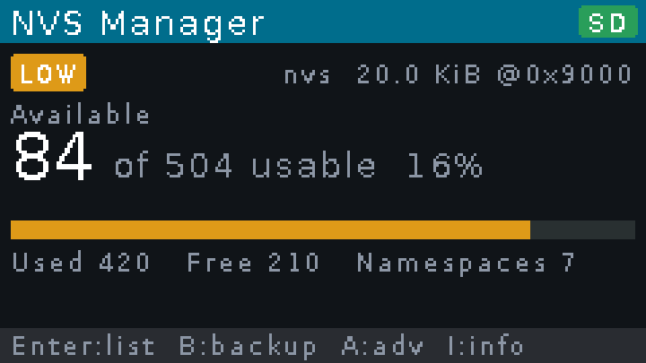
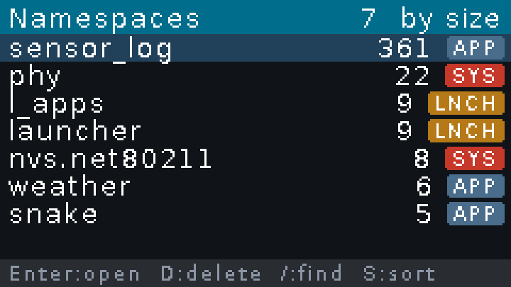
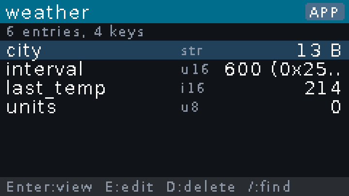
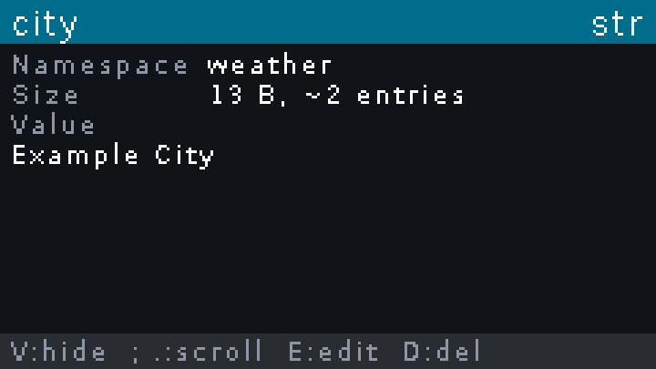

# NVS Manager

On-device inspector and manager for the ESP32 NVS (Non-Volatile Storage), for the M5Stack Cardputer family.

**Inspect first. Modify explicitly. Never erase automatically.**

<p>
  
  
  
  
</p>

Screenshots from the desktop build, with made-up example data.

## Why

Firmware images that run on the same device share one small NVS partition. On a device with a firmware launcher, every application leaves its namespaces behind until the partition runs out of entries. Applications that do not check NVS write results then fail in ways that look unrelated, such as settings that silently reset after a reboot.

NVS Manager shows how full the NVS really is and which namespaces use the space. It lets you remove or edit data deliberately, and back it up to the SD card first. "How full" means the entries still available for new data, not only the free ones.

## Devices

One firmware image runs on all three models.

| Device | Tested |
|---|---|
| M5Stack Cardputer v1.0 | standalone, and under Launcher 2.9.1 |
| M5Stack Cardputer v1.1 | under Launcher 2.9.1 |
| M5Stack Cardputer ADV | under Launcher 2.9.1 |

Other ESP32 devices, such as the LilyGo T-Deck Plus, may follow. The code keeps everything device-specific behind one platform layer.

## What it does

- **Dashboard.**
  - Health: OK, LOW (under 25 % available), CRITICAL (under 10 %) or FULL.
  - Available and usable entries, a usage bar, used and free entries.
  - Namespace count, and entries held by namespaces that can no longer be listed.
- **Namespaces.** Entries and key counts, sorting and search. Each namespace is labelled SYSTEM, LAUNCHER or APP.
- **Keys.** Type and size of each key, and search. A value stays hidden until you press `V`. Blobs show a hex preview.
- **Changes.**
  - Edit integer and string values (up to 255 characters).
  - Delete a key or a whole namespace.
  - Every change asks for confirmation, is committed, read back to verify, and reported with the entry counts before and after.
- **Backup and export to the SD card.**
  - A JSON export of the metadata (no values).
  - A JSON export with values.
  - A raw copy of the partition with a SHA-256 manifest.
  - Every file is read back and compared after writing.
- **Restore.** Puts a raw backup of this device back over the whole NVS partition. The backup is checked against its manifest first, and the NVS as it was is saved as a new backup, so a restore can be undone the same way.
- **Exit.** Restarts the device.

### Safety

- **Read-only until you ask.** Browsing, exporting and backing up never write to NVS. The firmware never stores its own settings there.
- **Protection by namespace class.**

  | Class | Namespaces | Change | Delete namespace |
  |---|---|---|---|
  | APP | everything else | Enter | held Enter |
  | LAUNCHER | `launcher`, `l_wifi`, `l_apps`, `l_bonds`, `nimble_bond`, `uiflow`, `touch_cal` | held Enter, with a warning | held Enter, with a warning |
  | SYSTEM | `nvs.net80211`, `phy` | only in Advanced mode, held Enter | only in Advanced mode, held Enter |

  Advanced mode (`A` on the dashboard) locks again after 5 minutes without a key press, on restart, or with `A`.
- **No automatic repair.**
  - The Arduino core normally erases an NVS partition it cannot open. NVS Manager blocks that erase, so a full or damaged NVS is shown as it is.
  - Nothing is ever erased or formatted on its own, neither NVS nor the SD card.
- **Values stay private.**
  - The serial log never contains values.
  - The value export and the raw backup ask first: they can contain Wi-Fi passwords, tokens and pairing keys.

## Installing

Release files, from the [releases page](../../releases):

| File | Use |
|---|---|
| `nvs-manager-<version>-cardputer-launcher.bin` | install through Launcher |
| `nvs-manager-<version>-cardputer-standalone.zip` | flash without Launcher; NVS stays untouched |
| `nvs-manager-<version>-cardputer-full-ERASES-NVS.bin` | one image from 0x0; **erases NVS** |
| `SHA256SUMS` | checksums |

### Through Launcher (recommended)

[Launcher](https://github.com/bmorcelli/Launcher) installs the app into its own app partition. It keeps the NVS partition, so NVS Manager sees exactly the data the other apps use.

**From Launcher's online catalog:** open `OTA`, find **NVS Manager for Cardputer & ADV** and install it. Launcher downloads the image published on M5Burner and writes only the app from it.

**From the SD card:**

1. Copy `nvs-manager-<version>-cardputer-launcher.bin` to the SD card.
2. In Launcher, open `SD`, select the file and choose `Install`.

Launcher's WebUI (`WUI`) can upload the same file. These are Launcher's documented ways. The tests on all three devices installed through Launcher's serial console, which writes the same kind of app partition.

**Getting back to Launcher.** Launcher shows its start screen only after a real power-on. A restart, including Exit in NVS Manager, starts NVS Manager again. To reach Launcher, switch the Cardputer off, unplug USB, and power it on again.

Launcher itself changes a few of its own namespaces when it installs an app or boots (`l_apps`, `l_bonds`, `launcher`, `l_wifi`). That is Launcher, not NVS Manager.

### Standalone

This replaces the firmware on the device, Launcher included, but does not write the NVS partition. Unzip `nvs-manager-<version>-cardputer-standalone.zip` and run:

```sh
esptool --chip esp32s3 --port PORT write-flash \
    0x0 bootloader.bin 0x8000 partitions.bin 0xe000 boot_app0.bin 0x10000 firmware.bin
```

The partition table keeps NVS at `0x9000` with `0x5000` bytes, as Launcher does, so existing data stays readable.

### Full image

`nvs-manager-<version>-cardputer-full-ERASES-NVS.bin` is a single image written at `0x0`. **Writing it erases the NVS partition,** because the image is blank there. It suits a clean device only; to inspect existing data, use one of the other two ways.

### M5Burner

The same full image is published in [M5Burner](https://docs.m5stack.com/en/uiflow/m5burner/intro) as **NVS Manager for Cardputer & ADV** (device type Cardputer). M5Burner writes it from `0x0`, so burning it there **erases the NVS partition** as well. To keep the existing data, install it through Launcher instead.

## Using it

On the Cardputer, the arrow legends are on the fn layer. Outside text fields, the plain keys work as well, except `/`, which is search.

| Key | Action |
|---|---|
| `;` `.` (fn: up, down) | move |
| `,` and fn + `/` | page up, page down |
| Enter | open, confirm |
| `` ` `` (fn: Esc), Del | back; Exit on the dashboard |
| `/` | search |
| `S` | sort |
| `R` | refresh |
| `V` | show or hide a value |
| `E` | edit |
| `D` | delete |
| `A` | Advanced mode |
| `B` | backup, export and restore |
| `I` | help |

The help screen (`I`) starts with the version and author, then explains entries, pages and why NVS can be full while a page is still physically empty.

### SD card

- **Format.** FAT12, FAT16, FAT32 and exFAT cards work. The card is never formatted.
- **Files.** They go to `/NVSManager/exports/` (JSON) and `/NVSManager/backups/` (raw partition and manifest).
- **Names.** Files are numbered (`nvs-0001.json`, `nvs-0001-values.json`, `nvs-0001.bin`), because the device has no clock.
- **Manifest.** It records the partition offset and size, entry statistics, device, chip, and the SHA-256 of the raw copy.

### Restoring a raw backup

`B`, then **Restore raw backup**, lists the raw backups on the card, newest first. Choosing one shows the NVS usage then and now, and checks the backup before anything is written. A restore is refused when:

- the manifest is missing, or the file does not match its size and SHA-256;
- the backup was made for a different partition, or the NVS is encrypted;
- the backup was made on another device (backups record a hash of the device's MAC address, never the address itself);
- the file is not a valid NVS image, or it already matches the NVS byte for byte.

Backups made by 0.9.0 did not record the device; they can still be restored, with a warning to use them only on the device they came from, because NVS holds that device's radio calibration.

After a held Enter, NVS Manager saves the current NVS as a new raw backup, then writes the backup one 4 KiB sector at a time, reading each sector back. The result names the backup that holds the NVS as it was before. Do not switch the device off while it runs.

A raw backup is a plain partition image, so `esptool write-flash 0x9000 nvs-NNNN.bin` also puts it back from a computer.

### Serial log

The USB serial port (115200 baud) reports the boot, the NVS statistics and each change. It lists namespaces, keys, types and sizes, and never values.

## Limitations

- Blob values are read-only.
- There is no rename or bulk delete, and a restore always puts back the whole partition, not single namespaces.
- Namespaces without keys, and entries left by deleted namespaces, take space but cannot be listed. The dashboard shows how many entries they hold.
- Only the partition labelled `nvs` is managed.
- Encrypted NVS partitions are reported as such but have not been tested.

## Building

The firmware builds with [PlatformIO](https://platformio.org/).

```sh
pio run -e cardputer     # device firmware: .pio/build/cardputer/
pio run -e native        # the same UI in an SDL2 window (needs SDL2)
```

Do not flash `.pio/build/cardputer/firmware.factory.bin`. PlatformIO merges it from `0x0`, and it erases NVS like the full image.

The desktop build runs the real ESP-IDF NVS code over a partition dump. Start it with:

```sh
NVSM_NVS_IMAGE=nvs.bin NVSM_SD_DIR=/some/dir .pio/build/native/program
```

It works on a copy in memory, so the dump file is never changed. `NVSM_SD_DIR` stands in for the SD card.

`tools/make-release.sh` builds the release files into `dist/`.

### Tools

| Tool | Purpose |
|---|---|
| `tools/nvs-diff.py` | compare two NVS dumps by key; never prints values |
| `tools/nvs-image/` | make test dumps: add keys, fill NVS up to LOW, CRITICAL or FULL |
| `tools/hw-*` | drive a device attached to another machine over SSH: probe, monitor, reset, NVS backup, flash, install through Launcher. Runners are listed in `hardware-runners.conf` (see the `.example` file) |

`docs/RESEARCH.md` records how NVS, the Arduino core and Launcher behave, with what was verified on hardware.

## License

[MIT](LICENSE), © Radim Vančo (FoxKyong). Third-party components are listed in [THIRD_PARTY_NOTICES.md](THIRD_PARTY_NOTICES.md).
